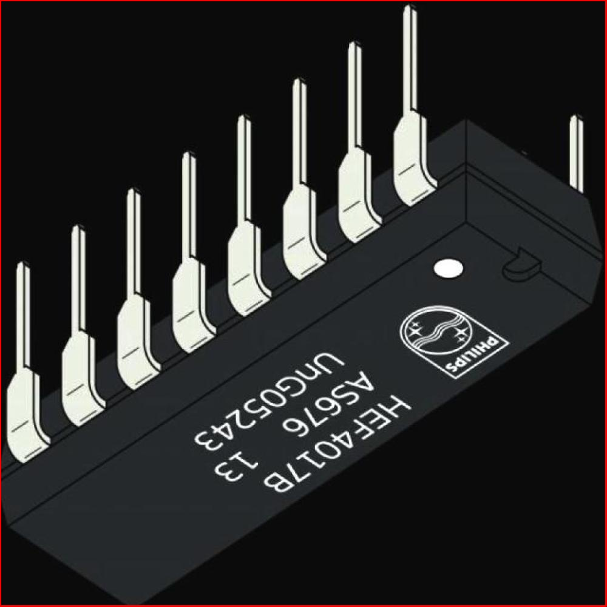

# 电子元件检测目标检测检测系统源码分享
 # [一条龙教学YOLOV8标注好的数据集一键训练_70+全套改进创新点发刊_Web前端展示]

### 1.研究背景与意义

项目参考[AAAI Association for the Advancement of Artificial Intelligence](https://gitee.com/qunmasj/projects)

研究背景与意义

随着电子技术的迅猛发展，电子元件的种类和数量不断增加，传统的人工检测方法已无法满足现代生产的高效率和高精度要求。电子元件在电路板上的组装和焊接过程中，任何微小的缺陷都可能导致整个电路的失效，因此，快速、准确地检测电子元件的存在与否，以及其位置和方向，成为了电子制造行业亟待解决的问题。近年来，计算机视觉和深度学习技术的飞速进步为这一问题提供了新的解决方案。特别是目标检测技术的不断演进，使得基于深度学习的自动化检测系统逐渐成为研究的热点。

YOLO（You Only Look Once）系列模型因其高效的实时检测能力而受到广泛关注。YOLOv8作为该系列的最新版本，结合了更深层次的网络结构和更先进的特征提取技术，能够在保持高准确率的同时，实现更快的检测速度。然而，尽管YOLOv8在一般目标检测任务中表现出色，但在特定的电子元件检测任务中，仍然面临着一些挑战，如小目标检测的精度不足、背景复杂性对检测结果的影响等。因此，基于改进YOLOv8的电子元件检测目标检测系统的研究显得尤为重要。

本研究将以“edit test pcb”模块为基础，利用包含2128张图像和5类电子元件（电容器、二极管、集成电路芯片、电感器和电阻器）的数据集，进行针对性的模型改进与优化。通过对数据集的深入分析，研究将探讨如何通过数据增强、特征融合和模型结构调整等手段，提升YOLOv8在电子元件检测中的性能。尤其是在小目标检测和复杂背景下的鲁棒性方面，研究将致力于提出有效的解决方案，以提高系统的实际应用价值。

本研究的意义不仅在于推动电子元件检测技术的发展，更在于为工业自动化和智能制造提供可靠的技术支持。通过构建高效的目标检测系统，可以显著提高生产线的检测效率，降低人工成本，减少人为错误，从而提升产品的整体质量和可靠性。此外，研究成果还可为其他领域的目标检测任务提供借鉴，推动计算机视觉技术在更广泛应用场景中的落地。

综上所述，基于改进YOLOv8的电子元件检测目标检测系统的研究，不仅具有重要的理论价值，也具备广泛的实际应用前景。通过深入探索和创新，期望能够为电子制造行业的智能化转型贡献一份力量，助力行业的可持续发展。

### 2.图片演示


##### 注意：由于此博客编辑较早，上面“2.图片演示”和“3.视频演示”展示的系统图片或者视频可能为老版本，新版本在老版本的基础上升级如下：（实际效果以升级的新版本为准）

  （1）适配了YOLOV8的“目标检测”模型和“实例分割”模型，通过加载相应的权重（.pt）文件即可自适应加载模型。

  （2）支持“图片识别”、“视频识别”、“摄像头实时识别”三种识别模式。

  （3）支持“图片识别”、“视频识别”、“摄像头实时识别”三种识别结果保存导出，解决手动导出（容易卡顿出现爆内存）存在的问题，识别完自动保存结果并导出到。

  （4）支持Web前端系统中的标题、背景图等自定义修改，后面提供修改教程。

  另外本项目提供训练的数据集和训练教程,暂不提供权重文件（best.pt）,需要您按照教程进行训练后实现图片演示和Web前端界面演示的效果。

### 3.视频演示

[3.1 视频演示](https://www.bilibili.com/video/BV1HbWreBErQ/?vd_source=ff015de2d29cbe2a9cdbfa7064407a08)

### 4.数据集信息展示

数据集信息展示

本数据集名为“edit test pcb”，专为改进YOLOv8的电子元件检测目标检测系统而设计，旨在提升电子元件的识别精度和效率。该数据集包含2128幅高质量图像，涵盖了五个主要类别的电子元件，分别是：SMD电容器（Capasistor_SMD）、SMD二极管（Diode_SMD）、集成电路芯片（IC_Chip）、SMD电感器（Inductor_SMD）和SMD电阻器（Resistor_SMD）。这些类别的选择反映了现代电子设备中常见的元件类型，具有广泛的应用场景。

数据集中的图像经过精心挑选和标注，确保每个类别的样本数量均衡且具有代表性。这种多样性使得模型在训练过程中能够学习到不同元件在各种环境下的特征，从而提高其在实际应用中的鲁棒性。每一幅图像都经过了标准化处理，以确保在不同光照、角度和背景下，模型能够有效识别目标。

数据集的构建遵循了开放数据的原则，采用了CC BY 4.0许可证，这意味着用户可以自由使用、修改和分发数据集，只需适当归属原作者。这种开放性不仅促进了学术研究的合作与交流，也为工业界的应用提供了便利。用户可以根据自身需求对数据集进行二次开发，进而推动电子元件检测技术的进步。

在训练YOLOv8模型时，数据集的多样性和丰富性将为模型提供强大的支持。YOLOv8作为一种先进的目标检测算法，具备快速且准确的检测能力。通过利用该数据集，研究人员和开发者可以优化模型的参数设置，调整网络结构，以达到更高的检测精度和更快的推理速度。特别是在实时检测应用中，如自动化生产线的质量监控和电子产品的故障诊断，精确的目标检测系统能够显著提高工作效率，降低人力成本。

此外，数据集的应用不仅限于训练和测试阶段，还可以用于模型的验证和性能评估。通过在不同的测试集上进行验证，研究人员可以全面了解模型在各种条件下的表现，从而进一步调整和优化模型的设计。这种反馈机制将有助于持续改进目标检测系统，确保其在实际应用中的可靠性和稳定性。

总之，“edit test pcb”数据集为电子元件检测领域提供了一个强有力的工具，支持YOLOv8模型的训练与优化。随着电子技术的不断发展，对高效、准确的目标检测系统的需求日益增加，利用该数据集进行深入研究和开发，将为相关领域的技术进步提供重要的推动力。通过不断的探索与创新，电子元件检测技术的未来将更加光明。




### 5.全套项目环境部署视频教程（零基础手把手教学）

[5.1 环境部署教程链接（零基础手把手教学）](https://www.ixigua.com/7404473917358506534?logTag=c807d0cbc21c0ef59de5)


[5.2 安装Python虚拟环境创建和依赖库安装视频教程链接（零基础手把手教学）](https://www.ixigua.com/7404474678003106304?logTag=1f1041108cd1f708b01a)

### 6.手把手YOLOV8训练视频教程（零基础小白有手就能学会）

[6.1 环境部署教程链接（零基础手把手教学）](https://www.ixigua.com/7404477157818401292?logTag=d31a2dfd1983c9668658)

### 7.70+种全套YOLOV8创新点代码加载调参视频教程（一键加载写好的改进模型的配置文件）

[7.1 环境部署教程链接（零基础手把手教学）](https://www.ixigua.com/7404478314661806627?logTag=29066f8288e3f4eea3a4)

### 8.70+种全套YOLOV8创新点原理讲解（非科班也可以轻松写刊发刊，V10版本正在科研待更新）

由于篇幅限制，每个创新点的具体原理讲解就不一一展开，具体见下列网址中的创新点对应子项目的技术原理博客网址【Blog】：


[8.1 70+种全套YOLOV8创新点原理讲解链接](https://gitee.com/qunmasj/good)

### 9.系统功能展示（检测对象为举例，实际内容以本项目数据集为准）

图1.系统支持检测结果表格显示

  图2.系统支持置信度和IOU阈值手动调节

  图3.系统支持自定义加载权重文件best.pt(需要你通过步骤5中训练获得)

  图4.系统支持摄像头实时识别

  图5.系统支持图片识别

  图6.系统支持视频识别

  图7.系统支持识别结果文件自动保存

  图8.系统支持Excel导出检测结果数据


### 10.原始YOLOV8算法原理

原始YOLOv8算法原理

YOLOv8作为目标检测领域的最新代表，凭借其卓越的性能和灵活的架构，迅速在学术界和工业界引起了广泛关注。该算法的设计理念源于YOLO系列的传统优势，即在保证高精度的同时实现实时检测。YOLOv8不仅吸收了前几代YOLO模型的优点，还融合了YOLOX、YOLOv6、YOLOv7以及PP-YOLOE等算法的创新设计，形成了一种更加高效和灵活的检测模型。

YOLOv8的网络结构主要由四个部分组成：输入层、Backbone骨干网络、Neck特征融合网络和Head检测模块。输入层负责对输入图像进行预处理，包括调整图像比例、实现Mosaic增强以及瞄点计算等。这些预处理步骤旨在提升模型对多样化图像的适应能力，从而提高后续特征提取的有效性。

在Backbone部分，YOLOv8采用了经过优化的DarkNet结构，使用C2f模块替代了传统的C3模块。这一改进使得模型在不同尺度上能够获得更丰富的梯度流动信息，保持了轻量级特性，同时提升了特征提取的能力。C2f模块的设计不仅提高了特征提取的效率，还增强了模型对细节信息的捕捉能力，进而提升了检测精度。为了进一步增强特征图的表达能力，YOLOv8引入了SPPF模块，通过不同内核尺寸的池化操作对特征图进行合并，确保了特征信息的全面性和多样性。

Neck部分采用了“双塔结构”，结合了特征金字塔和路径聚合网络。这一设计有效促进了语义特征和定位特征之间的转移，增强了网络的特征融合能力，使得YOLOv8在面对不同尺度目标时，能够更加灵活地调整检测策略。特征金字塔的引入使得模型能够在多层次上进行特征提取，从而提高了对小目标和大目标的检测性能。

Head检测模块是YOLOv8的核心部分，包含三个解耦头，分别负责回归和分类任务。解耦头的设计理念在于将回归分支和预测分支进行分离，这一创新显著加速了模型的收敛速度，并提高了检测的准确性。通过将不同任务的输出分开处理，YOLOv8能够更有效地利用特征信息，减少了任务之间的干扰，从而提升了整体性能。

在模型设置方面，YOLOv8提供了多种参数配置选项，包括depth_factor、width_factor和ratio等。这些参数的设置直接影响到模型的深度、宽度和通道数，使得用户能够根据具体应用场景灵活调整模型的结构。例如，depth_factor和width_factor的增大将使得网络按比例变深和变宽，从而增强模型的表达能力；而通过调整ratio参数，用户可以灵活控制基础通道数，进一步优化模型性能。

YOLOv8的成功不仅在于其创新的网络结构和灵活的参数设置，还在于其在实际应用中的广泛适用性。得益于高精度和快速推理的特点，YOLOv8在目标检测任务中表现出色，尤其在农业、安防、自动驾驶等领域展现了巨大的应用潜力。例如，在苹果采摘的应用场景中，YOLOv8能够快速准确地识别和定位苹果，为自动采摘机器人提供可靠的视觉支持。此外，结合蚁群算法进行路径规划，进一步提升了自动采摘的效率，使得这一技术在实际生产中具有了更高的实用价值。

综上所述，YOLOv8作为目标检测领域的前沿模型，通过优化的网络结构、灵活的参数设置和广泛的应用潜力，展现了其在实时检测中的强大能力。其设计理念和实现方法不仅为目标检测技术的发展提供了新的思路，也为未来的研究和应用奠定了坚实的基础。随着YOLOv8的不断发展和完善，预计将在更多领域实现突破，推动目标检测技术的进一步进步。


### 11.项目核心源码讲解（再也不用担心看不懂代码逻辑）

#### 11.1 ultralytics\utils\loss.py

以下是经过精简和注释的核心代码部分，主要包括损失函数的实现，适用于YOLO模型的训练。注释详细解释了每个类和方法的功能。

```python
import torch
import torch.nn as nn
import torch.nn.functional as F

class VarifocalLoss(nn.Module):
    """
    Varifocal Loss类，基于Zhang等人的论文实现。
    该损失函数用于处理目标检测中的不平衡问题。
    """

    def __init__(self):
        """初始化VarifocalLoss类。"""
        super().__init__()

    @staticmethod
    def forward(pred_score, gt_score, label, alpha=0.75, gamma=2.0):
        """
        计算Varifocal损失。
        
        参数:
        - pred_score: 预测的分数
        - gt_score: 真实分数
        - label: 标签
        - alpha: 权重因子
        - gamma: 调制因子
        
        返回:
        - loss: 计算得到的损失值
        """
        weight = alpha * pred_score.sigmoid().pow(gamma) * (1 - label) + gt_score * label
        loss = (
            (F.binary_cross_entropy_with_logits(pred_score.float(), gt_score.float(), reduction="none") * weight)
            .mean(1)
            .sum()
        )
        return loss


class BboxLoss(nn.Module):
    """用于计算边界框损失的类。"""

    def __init__(self, reg_max, use_dfl=False):
        """初始化BboxLoss模块。"""
        super().__init__()
        self.reg_max = reg_max  # 最大回归值
        self.use_dfl = use_dfl  # 是否使用分布焦点损失

    def forward(self, pred_dist, pred_bboxes, anchor_points, target_bboxes, target_scores, target_scores_sum, fg_mask):
        """
        计算IoU损失和DFL损失。
        
        参数:
        - pred_dist: 预测的分布
        - pred_bboxes: 预测的边界框
        - anchor_points: 锚点
        - target_bboxes: 目标边界框
        - target_scores: 目标分数
        - target_scores_sum: 目标分数总和
        - fg_mask: 前景掩码
        
        返回:
        - loss_iou: IoU损失
        - loss_dfl: DFL损失
        """
        weight = target_scores.sum(-1)[fg_mask].unsqueeze(-1)
        iou = bbox_iou(pred_bboxes[fg_mask], target_bboxes[fg_mask], xywh=False, CIoU=True)
        loss_iou = ((1.0 - iou) * weight).sum() / target_scores_sum

        # DFL损失
        if self.use_dfl:
            target_ltrb = bbox2dist(anchor_points, target_bboxes, self.reg_max)
            loss_dfl = self._df_loss(pred_dist[fg_mask].view(-1, self.reg_max + 1), target_ltrb[fg_mask]) * weight
            loss_dfl = loss_dfl.sum() / target_scores_sum
        else:
            loss_dfl = torch.tensor(0.0).to(pred_dist.device)

        return loss_iou, loss_dfl

    @staticmethod
    def _df_loss(pred_dist, target):
        """计算DFL损失。"""
        tl = target.long()  # 左边界
        tr = tl + 1  # 右边界
        wl = tr - target  # 左权重
        wr = 1 - wl  # 右权重
        return (
            F.cross_entropy(pred_dist, tl.view(-1), reduction="none").view(tl.shape) * wl
            + F.cross_entropy(pred_dist, tr.view(-1), reduction="none").view(tl.shape) * wr
        ).mean(-1, keepdim=True)


class v8DetectionLoss:
    """用于计算YOLO模型训练损失的类。"""

    def __init__(self, model):
        """初始化v8DetectionLoss，设置模型相关属性。"""
        device = next(model.parameters()).device  # 获取模型设备
        h = model.args  # 超参数

        m = model.model[-1]  # Detect()模块
        self.bce = nn.BCEWithLogitsLoss(reduction="none")  # 二元交叉熵损失
        self.hyp = h
        self.stride = m.stride  # 模型步幅
        self.nc = m.nc  # 类别数量
        self.reg_max = m.reg_max
        self.device = device
        self.use_dfl = m.reg_max > 1  # 是否使用DFL

        self.bbox_loss = BboxLoss(m.reg_max - 1, use_dfl=self.use_dfl).to(device)  # 边界框损失实例

    def __call__(self, preds, batch):
        """计算并返回YOLO模型的损失。"""
        loss = torch.zeros(3, device=self.device)  # box, cls, dfl
        feats = preds[1] if isinstance(preds, tuple) else preds
        pred_distri, pred_scores = torch.cat([xi.view(feats[0].shape[0], self.nc, -1) for xi in feats], 2).split(
            (self.reg_max * 4, self.nc), 1
        )

        pred_scores = pred_scores.permute(0, 2, 1).contiguous()
        pred_distri = pred_distri.permute(0, 2, 1).contiguous()

        # 目标处理
        targets = torch.cat((batch["batch_idx"].view(-1, 1), batch["cls"].view(-1, 1), batch["bboxes"]), 1)
        gt_labels, gt_bboxes = targets.split((1, 4), 2)  # 类别和边界框
        mask_gt = gt_bboxes.sum(2, keepdim=True).gt_(0)  # 生成前景掩码

        # 计算损失
        _, target_bboxes, target_scores, fg_mask, _ = self.assigner(
            pred_scores.detach().sigmoid(),
            pred_bboxes.detach(),
            gt_labels,
            gt_bboxes,
            mask_gt,
        )

        target_scores_sum = max(target_scores.sum(), 1)

        # 分类损失
        loss[1] = self.bce(pred_scores, target_scores.to(pred_scores.dtype)).sum() / target_scores_sum  # BCE

        # 边界框损失
        if fg_mask.sum():
            loss[0], loss[2] = self.bbox_loss(
                pred_distri, pred_bboxes, target_bboxes, target_scores, target_scores_sum, fg_mask
            )

        return loss.sum() * batch_size, loss.detach()  # 返回总损失和分离的损失
```

### 代码说明
1. **VarifocalLoss**: 实现了Varifocal损失，用于解决目标检测中的类别不平衡问题。
2. **BboxLoss**: 计算边界框的损失，包括IoU损失和可选的DFL损失。
3. **v8DetectionLoss**: 主要的损失计算类，负责整合不同的损失计算，包括分类损失和边界框损失。

这些类和方法构成了YOLO模型训练过程中的核心损失计算逻辑，确保模型能够有效地学习目标检测任务。

这个文件是一个实现了多种损失函数的模块，主要用于目标检测和相关任务的训练。它包含了多种损失类，分别用于计算不同类型的损失，包括目标检测的边界框损失、分类损失、关键点损失等。下面是对文件中各个部分的详细说明。

首先，文件引入了必要的库，包括PyTorch及其相关模块。接着定义了多个损失类，每个类都继承自`nn.Module`，并实现了`forward`方法来计算损失。

`VarifocalLoss`类实现了一种变焦损失函数，它通过调整预测分数和真实分数的权重来计算损失。这个损失函数在处理不平衡数据时特别有效，使用了sigmoid函数和二元交叉熵损失。

`FocalLoss`类则实现了焦点损失，这是一种用于解决类别不平衡问题的损失函数。它通过调整损失的权重来关注难以分类的样本，增强模型对这些样本的学习能力。

`BboxLoss`类计算边界框的损失，主要使用IoU（Intersection over Union）来评估预测框与真实框之间的重叠程度。它还可以选择性地使用DFL（Distribution Focal Loss）来进一步优化边界框的预测。

`RotatedBboxLoss`类是`BboxLoss`的扩展，专门用于处理旋转边界框的损失计算，适用于需要考虑物体方向的场景。

`KeypointLoss`类计算关键点的损失，主要用于姿态估计等任务。它通过计算预测关键点与真实关键点之间的欧几里得距离来评估模型的性能。

`v8DetectionLoss`类是一个综合性的损失类，负责计算目标检测任务中的各种损失，包括边界框损失、分类损失和DFL损失。它还实现了目标的预处理和后处理，确保输入数据的格式正确。

`v8SegmentationLoss`类继承自`v8DetectionLoss`，并增加了对分割任务的支持，计算分割损失。

`v8PoseLoss`类同样继承自`v8DetectionLoss`，并专注于姿态估计任务，计算关键点的损失。

`v8ClassificationLoss`类则专注于分类任务，计算分类损失。

最后，`v8OBBLoss`类是一个专门用于处理旋转边界框的损失类，类似于`v8DetectionLoss`，但针对特定的OBB（Oriented Bounding Box）任务进行了优化。

整体而言，这个文件提供了一系列强大的损失函数，适用于不同的计算机视觉任务，特别是在目标检测和分割领域。通过合理选择和组合这些损失函数，可以有效提升模型的性能。

#### 11.2 ultralytics\models\fastsam\val.py

以下是代码中最核心的部分，并附上详细的中文注释：

```python
# 导入必要的模块
from ultralytics.models.yolo.segment import SegmentationValidator
from ultralytics.utils.metrics import SegmentMetrics

class FastSAMValidator(SegmentationValidator):
    """
    自定义验证类，用于在Ultralytics YOLO框架中进行快速SAM（Segment Anything Model）分割。

    该类扩展了SegmentationValidator类，专门定制了快速SAM的验证过程。它将任务设置为'分割'，
    并使用SegmentMetrics进行评估。此外，为了避免在验证过程中出现错误，禁用了绘图功能。
    """

    def __init__(self, dataloader=None, save_dir=None, pbar=None, args=None, _callbacks=None):
        """
        初始化FastSAMValidator类，将任务设置为'分割'，并将指标设置为SegmentMetrics。

        参数：
            dataloader (torch.utils.data.DataLoader): 用于验证的数据加载器。
            save_dir (Path, optional): 保存结果的目录。
            pbar (tqdm.tqdm): 用于显示进度的进度条。
            args (SimpleNamespace): 验证器的配置。
            _callbacks (dict): 存储各种回调函数的字典。

        注意：
            在此类中禁用了ConfusionMatrix和其他相关指标的绘图，以避免错误。
        """
        # 调用父类的初始化方法
        super().__init__(dataloader, save_dir, pbar, args, _callbacks)
        # 设置任务类型为'分割'
        self.args.task = "segment"
        # 禁用绘图功能，以避免在验证过程中出现错误
        self.args.plots = False  
        # 初始化分割指标
        self.metrics = SegmentMetrics(save_dir=self.save_dir, on_plot=self.on_plot)
```

### 代码核心部分说明：
1. **类定义**：`FastSAMValidator`类继承自`SegmentationValidator`，用于定制快速SAM的验证过程。
2. **初始化方法**：在`__init__`方法中，设置了验证所需的参数，包括数据加载器、保存目录、进度条、配置参数和回调函数。
3. **任务设置**：将任务类型设置为“分割”，并禁用绘图功能，以避免在验证过程中可能出现的错误。
4. **指标初始化**：使用`SegmentMetrics`类来初始化分割指标，以便在验证过程中进行评估。

这个程序文件定义了一个名为 `FastSAMValidator` 的类，继承自 `SegmentationValidator`，用于在 Ultralytics YOLO 框架中进行快速 SAM（Segment Anything Model）分割的自定义验证。该类的主要目的是定制验证过程，以适应快速 SAM 的需求。

在类的文档字符串中，详细描述了该类的功能和属性。`FastSAMValidator` 类将任务设置为“分割”，并使用 `SegmentMetrics` 进行评估。此外，为了避免在验证过程中出现错误，该类禁用了绘图功能。

构造函数 `__init__` 接受多个参数，包括数据加载器、结果保存目录、进度条、配置参数和回调函数字典。构造函数首先调用父类的初始化方法，然后将任务类型设置为“segment”，并禁用绘图功能。最后，它实例化 `SegmentMetrics`，用于后续的性能评估。

总的来说，这个类的设计旨在提供一个专门针对快速 SAM 的验证工具，简化了分割任务的评估过程，并确保在验证时不会因为绘图而导致错误。

#### 11.3 ui.py

```python
import sys
import subprocess

def run_script(script_path):
    """
    使用当前 Python 环境运行指定的脚本。

    Args:
        script_path (str): 要运行的脚本路径

    Returns:
        None
    """
    # 获取当前 Python 解释器的路径
    python_path = sys.executable

    # 构建运行命令，使用 streamlit 运行指定的脚本
    command = f'"{python_path}" -m streamlit run "{script_path}"'

    # 执行命令并等待其完成
    result = subprocess.run(command, shell=True)
    
    # 检查命令执行结果，如果返回码不为0，表示执行出错
    if result.returncode != 0:
        print("脚本运行出错。")


# 主程序入口
if __name__ == "__main__":
    # 指定要运行的脚本路径
    script_path = "web.py"  # 这里可以直接使用脚本名，假设它在当前目录下

    # 调用函数运行脚本
    run_script(script_path)
```

### 代码注释说明：
1. **导入模块**：
   - `sys`：用于获取当前 Python 解释器的路径。
   - `subprocess`：用于执行外部命令。

2. **`run_script` 函数**：
   - 该函数接受一个参数 `script_path`，表示要运行的 Python 脚本的路径。
   - 使用 `sys.executable` 获取当前 Python 解释器的路径。
   - 构建一个命令字符串，使用 `streamlit` 模块运行指定的脚本。
   - 使用 `subprocess.run` 执行命令，并等待其完成。
   - 检查命令的返回码，如果不为0，表示脚本运行出错，打印错误信息。

3. **主程序入口**：
   - 使用 `if __name__ == "__main__":` 确保只有在直接运行该脚本时才会执行以下代码。
   - 指定要运行的脚本路径为 `web.py`。
   - 调用 `run_script` 函数，传入脚本路径以执行该脚本。

这个程序文件名为 `ui.py`，主要功能是使用当前的 Python 环境来运行一个指定的脚本，具体是通过 Streamlit 来启动一个 Web 应用。

首先，程序导入了几个必要的模块，包括 `sys`、`os` 和 `subprocess`。其中，`sys` 模块用于访问与 Python 解释器相关的变量和函数，`os` 模块提供了与操作系统交互的功能，而 `subprocess` 模块则用于创建新进程、连接到它们的输入/输出/错误管道，并获取它们的返回码。

接下来，程序定义了一个名为 `run_script` 的函数，该函数接受一个参数 `script_path`，表示要运行的脚本的路径。在函数内部，首先获取当前 Python 解释器的路径，存储在 `python_path` 变量中。然后，构建一个命令字符串 `command`，该命令使用当前的 Python 解释器来运行指定的脚本，具体是通过 `streamlit run` 命令来启动 Web 应用。

接着，使用 `subprocess.run` 方法执行构建好的命令。如果命令执行后返回的状态码不为 0，表示脚本运行出错，程序会打印出错误信息。

在文件的最后部分，程序通过 `if __name__ == "__main__":` 判断是否是直接运行该脚本。如果是，程序会指定要运行的脚本路径，这里使用了 `abs_path` 函数来获取 `web.py` 的绝对路径。然后调用 `run_script` 函数来执行这个脚本。

总的来说，这个程序的主要目的是为了方便地启动一个基于 Streamlit 的 Web 应用，通过指定脚本路径来实现动态运行。

#### 11.4 ultralytics\models\utils\ops.py

以下是代码中最核心的部分，并附上详细的中文注释：

```python
import torch
import torch.nn as nn
import torch.nn.functional as F
from scipy.optimize import linear_sum_assignment
from ultralytics.utils.metrics import bbox_iou

class HungarianMatcher(nn.Module):
    """
    实现匈牙利匹配器的模块，用于解决预测框与真实框之间的最佳匹配问题。
    匈牙利匹配器通过一个成本函数对预测框和真实框进行最优分配，考虑了分类分数、边界框坐标等因素。
    """

    def __init__(self, cost_gain=None, use_fl=True, with_mask=False, num_sample_points=12544, alpha=0.25, gamma=2.0):
        """初始化匈牙利匹配器，包括成本系数、Focal Loss、掩码预测、采样点等参数。"""
        super().__init__()
        if cost_gain is None:
            cost_gain = {"class": 1, "bbox": 5, "giou": 2, "mask": 1, "dice": 1}
        self.cost_gain = cost_gain  # 成本系数
        self.use_fl = use_fl  # 是否使用Focal Loss
        self.with_mask = with_mask  # 是否进行掩码预测
        self.num_sample_points = num_sample_points  # 掩码成本计算的采样点数量
        self.alpha = alpha  # Focal Loss中的alpha因子
        self.gamma = gamma  # Focal Loss中的gamma因子

    def forward(self, pred_bboxes, pred_scores, gt_bboxes, gt_cls, gt_groups, masks=None, gt_mask=None):
        """
        前向传播，计算预测框与真实框之间的匹配。
        计算成本矩阵并找到最佳匹配。
        """
        bs, nq, nc = pred_scores.shape  # 批次大小、查询数量、类别数量

        if sum(gt_groups) == 0:  # 如果没有真实框，返回空匹配
            return [(torch.tensor([], dtype=torch.long), torch.tensor([], dtype=torch.long)) for _ in range(bs)]

        # 将预测分数和边界框展平以计算成本矩阵
        pred_scores = pred_scores.detach().view(-1, nc)
        pred_scores = F.sigmoid(pred_scores) if self.use_fl else F.softmax(pred_scores, dim=-1)
        pred_bboxes = pred_bboxes.detach().view(-1, 4)

        # 计算分类成本
        pred_scores = pred_scores[:, gt_cls]  # 选择与真实类别对应的预测分数
        if self.use_fl:  # 使用Focal Loss计算成本
            neg_cost_class = (1 - self.alpha) * (pred_scores**self.gamma) * (-(1 - pred_scores + 1e-8).log())
            pos_cost_class = self.alpha * ((1 - pred_scores) ** self.gamma) * (-(pred_scores + 1e-8).log())
            cost_class = pos_cost_class - neg_cost_class
        else:
            cost_class = -pred_scores  # 直接使用负的预测分数作为成本

        # 计算边界框之间的L1成本
        cost_bbox = (pred_bboxes.unsqueeze(1) - gt_bboxes.unsqueeze(0)).abs().sum(-1)  # (bs*num_queries, num_gt)

        # 计算边界框之间的GIoU成本
        cost_giou = 1.0 - bbox_iou(pred_bboxes.unsqueeze(1), gt_bboxes.unsqueeze(0), xywh=True, GIoU=True).squeeze(-1)

        # 最终成本矩阵
        C = (
            self.cost_gain["class"] * cost_class
            + self.cost_gain["bbox"] * cost_bbox
            + self.cost_gain["giou"] * cost_giou
        )

        # 将无效值（NaN和无穷大）设置为0
        C[C.isnan() | C.isinf()] = 0.0

        C = C.view(bs, nq, -1).cpu()  # 重新调整成本矩阵形状
        indices = [linear_sum_assignment(c[i]) for i, c in enumerate(C.split(gt_groups, -1))]  # 使用匈牙利算法找到最佳匹配
        gt_groups = torch.as_tensor([0, *gt_groups[:-1]]).cumsum_(0)  # 计算真实框的索引
        return [
            (torch.tensor(i, dtype=torch.long), torch.tensor(j, dtype=torch.long) + gt_groups[k])
            for k, (i, j) in enumerate(indices)
        ]
```

### 代码核心部分解释：
1. **类定义**：`HungarianMatcher`类实现了匈牙利算法用于目标检测中的匹配问题。
2. **初始化方法**：构造函数接受多个参数来设置成本计算的细节，包括分类、边界框和GIoU的权重。
3. **前向传播方法**：`forward`方法是匹配的核心，计算预测框与真实框之间的成本，并返回最佳匹配的索引。
4. **成本计算**：
   - 分类成本使用Focal Loss或Softmax计算。
   - L1成本计算边界框之间的绝对差。
   - GIoU成本计算边界框之间的广义交并比。
5. **匹配算法**：使用`linear_sum_assignment`函数实现匈牙利算法，找到最佳匹配的索引。

以上代码片段是实现目标检测中预测框与真实框匹配的核心部分，包含了重要的成本计算和匹配逻辑。

这个程序文件实现了一个名为 `HungarianMatcher` 的类，主要用于解决目标检测中的分配问题。它通过匈牙利算法在预测的边界框和真实的边界框之间进行最优匹配，考虑了分类分数、边界框坐标以及可选的掩码预测。类的构造函数允许用户设置成本系数、是否使用焦点损失、是否进行掩码预测、样本点数量以及焦点损失的参数（alpha 和 gamma）。

在 `forward` 方法中，首先对输入的预测边界框和分数进行处理。如果没有真实目标，返回空的索引。接着，计算分类成本、边界框之间的 L1 成本和 GIoU 成本。分类成本的计算方式取决于是否使用焦点损失。最终，构建一个成本矩阵，结合各项成本并进行匈牙利算法求解，返回每个批次中选择的预测和真实目标的索引。

文件中还定义了一个 `get_cdn_group` 函数，用于生成对比去噪训练组。该函数从真实目标中创建正负样本，应用噪声到类别标签和边界框坐标，并返回修改后的标签、边界框、注意力掩码和元信息。该函数在训练模式下工作，允许用户设置去噪样本的数量、类别噪声比例和边界框噪声规模。

总体而言，这个文件提供了目标检测模型中重要的匹配和去噪功能，支持模型在训练过程中更好地处理预测和真实数据之间的关系。

#### 11.5 ultralytics\utils\callbacks\hub.py

以下是代码中最核心的部分，并附上详细的中文注释：

```python
import json
from time import time
from ultralytics.hub.utils import HUB_WEB_ROOT, PREFIX, events
from ultralytics.utils import LOGGER, SETTINGS

def on_fit_epoch_end(trainer):
    """在每个训练周期结束时上传训练进度指标。"""
    session = getattr(trainer, "hub_session", None)  # 获取训练器的会话对象
    if session:
        # 收集训练损失和指标
        all_plots = {
            **trainer.label_loss_items(trainer.tloss, prefix="train"),  # 获取训练损失项
            **trainer.metrics,  # 获取训练指标
        }
        if trainer.epoch == 0:
            from ultralytics.utils.torch_utils import model_info_for_loggers
            # 如果是第一个周期，添加模型信息
            all_plots = {**all_plots, **model_info_for_loggers(trainer)}

        # 将当前周期的指标序列化为JSON格式并存入队列
        session.metrics_queue[trainer.epoch] = json.dumps(all_plots)
        
        # 检查是否超过上传速率限制
        if time() - session.timers["metrics"] > session.rate_limits["metrics"]:
            session.upload_metrics()  # 上传指标
            session.timers["metrics"] = time()  # 重置计时器
            session.metrics_queue = {}  # 重置队列

def on_train_end(trainer):
    """在训练结束时上传最终模型和指标到Ultralytics HUB。"""
    session = getattr(trainer, "hub_session", None)  # 获取训练器的会话对象
    if session:
        # 上传最终模型和指标
        LOGGER.info(f"{PREFIX}Syncing final model...")  # 记录日志
        session.upload_model(
            trainer.epoch,  # 当前周期
            trainer.best,  # 最佳模型
            map=trainer.metrics.get("metrics/mAP50-95(B)", 0),  # 获取mAP指标
            final=True,  # 标记为最终模型
        )
        session.alive = False  # 停止心跳
        LOGGER.info(f"{PREFIX}Done ✅\n" f"{PREFIX}View model at {session.model_url} 🚀")  # 记录完成信息

# 定义回调函数
callbacks = (
    {
        "on_fit_epoch_end": on_fit_epoch_end,  # 训练周期结束时的回调
        "on_train_end": on_train_end,  # 训练结束时的回调
    }
    if SETTINGS["hub"] is True  # 如果启用了hub功能
    else {}
)  # 验证是否启用
```

### 代码核心部分说明：
1. **on_fit_epoch_end**: 该函数在每个训练周期结束时被调用，负责收集并上传训练进度指标。它会检查是否超过了上传速率限制，并在满足条件时上传数据。
2. **on_train_end**: 该函数在训练结束时被调用，负责上传最终模型和相关指标到Ultralytics HUB，并记录相关日志信息。
3. **callbacks**: 这是一个字典，定义了在特定事件（如训练周期结束和训练结束）时调用的回调函数。根据设置决定是否启用这些回调。

这个程序文件是 Ultralytics YOLO 项目中的一个回调函数模块，主要用于在训练、验证和预测过程中与 Ultralytics HUB 进行交互。代码中定义了一系列回调函数，这些函数在特定事件发生时被调用，以便上传训练进度、模型和相关指标。

首先，`on_pretrain_routine_end` 函数在预训练例程结束时被调用。它的作用是记录上传速率限制的计时器，确保在上传数据时遵循相应的限制。

接下来，`on_fit_epoch_end` 函数在每个训练周期结束时被调用。它负责上传训练进度的指标。在第一次训练周期结束时，它还会收集模型的信息并将其与其他指标一起上传。如果上传的时间间隔超过了设定的速率限制，则会执行上传操作，并重置计时器和指标队列。

`on_model_save` 函数用于保存模型检查点，并同样遵循速率限制。在上传检查点时，它会检查当前的模型是否是最佳模型，并在满足速率限制的情况下上传。

`on_train_end` 函数在训练结束时被调用，负责上传最终的模型和指标。它会同步最终模型，并在上传完成后停止心跳检测。

此外，还有一些函数如 `on_train_start`、`on_val_start`、`on_predict_start` 和 `on_export_start`，这些函数在训练、验证、预测和导出开始时被调用，主要用于执行相关事件。

最后，代码中的 `callbacks` 字典将上述所有回调函数组织在一起，只有在设置中启用了 HUB 功能时，这些回调函数才会被使用。这种设计使得代码在与 Ultralytics HUB 交互时更加灵活和高效。

#### 11.6 train.py

以下是经过简化并添加详细中文注释的核心代码部分：

```python
import os
import torch
import yaml
from ultralytics import YOLO  # 导入YOLO模型

# 设置设备为GPU（如果可用），否则使用CPU
device = "0" if torch.cuda.is_available() else "cpu"

if __name__ == '__main__':  # 确保该模块被直接运行时才执行以下代码
    workers = 1  # 设置数据加载的工作进程数
    batch = 2    # 设置每个批次的大小

    data_name = "data"  # 数据集名称
    # 获取数据集配置文件的绝对路径
    data_path = abs_path(f'datasets/{data_name}/{data_name}.yaml', path_type='current')  
    unix_style_path = data_path.replace(os.sep, '/')  # 将路径转换为Unix风格

    # 获取数据集目录路径
    directory_path = os.path.dirname(unix_style_path)
    
    # 读取YAML配置文件
    with open(data_path, 'r') as file:
        data = yaml.load(file, Loader=yaml.FullLoader)
    
    # 如果YAML文件中包含'path'项，则修改为当前目录路径
    if 'path' in data:
        data['path'] = directory_path
        # 将修改后的数据写回YAML文件
        with open(data_path, 'w') as file:
            yaml.safe_dump(data, file, sort_keys=False)

    # 加载YOLOv8模型，指定配置文件和任务类型
    model = YOLO(model='./ultralytics/cfg/models/v8/yolov8s.yaml', task='detect')  
    
    # 开始训练模型
    results2 = model.train(
        data=data_path,  # 指定训练数据的配置文件路径
        device=device,    # 指定训练设备
        workers=workers,  # 指定数据加载的工作进程数
        imgsz=640,        # 指定输入图像的大小为640x640
        epochs=100,       # 指定训练100个epoch
        batch=batch,      # 指定每个批次的大小
        name='train_v8_' + data_name  # 指定训练任务的名称
    )
```

### 代码注释说明：
1. **设备选择**：根据是否有可用的GPU，选择相应的计算设备。
2. **数据集路径**：通过数据集名称构建YAML配置文件的路径，并读取该文件。
3. **YAML文件处理**：读取YAML文件后，检查并更新其中的路径项，确保指向正确的目录。
4. **模型加载**：加载YOLOv8模型，准备进行目标检测任务。
5. **模型训练**：使用指定的参数开始训练模型，包括数据路径、设备、工作进程数、图像大小、训练轮数和批次大小等。

该程序文件 `train.py` 是一个用于训练 YOLOv8 模型的脚本。首先，程序导入了必要的库，包括 `os`、`torch`、`yaml` 和 `ultralytics` 中的 YOLO 模型。接着，程序通过检查 CUDA 是否可用来确定使用 GPU 还是 CPU 进行训练。

在 `if __name__ == '__main__':` 这一块代码中，程序首先设置了一些训练参数，如工作进程数 `workers` 和批次大小 `batch`。然后定义了数据集的名称为 `data`，并构建了数据集 YAML 文件的绝对路径。通过 `abs_path` 函数，程序获取了数据集的路径，并将路径中的分隔符统一为 Unix 风格。

接下来，程序获取了数据集目录的路径，并打开指定的 YAML 文件以读取数据。使用 `yaml.load` 函数读取 YAML 文件的内容后，程序检查是否存在 `path` 项，如果存在，则将其修改为数据集的目录路径，并将更新后的数据写回到 YAML 文件中，确保后续的训练能够正确找到数据集。

随后，程序加载了预训练的 YOLOv8 模型，指定了模型的配置文件。接着，调用 `model.train` 方法开始训练模型。在训练过程中，程序指定了训练数据的配置文件路径、设备、工作进程数、输入图像的大小（640x640）、训练的 epoch 数（100）以及批次大小（2）。最后，训练任务的名称被设置为 `train_v8_` 加上数据集的名称。

整体来看，该脚本的功能是配置并启动 YOLOv8 模型的训练过程，确保数据集路径正确，并根据指定的参数进行训练。

### 12.系统整体结构（节选）

### 整体功能和构架概括

该项目是一个基于 Ultralytics YOLO 框架的计算机视觉应用，主要用于目标检测和分割任务。项目的结构包括多个模块和文件，每个文件实现了特定的功能，协同工作以支持模型的训练、验证、推理和回调机制。整体上，项目提供了丰富的功能，包括损失计算、模型验证、用户界面、模型训练、回调处理等，旨在提升目标检测和分割模型的性能和易用性。

### 文件功能整理表

| 文件路径                                         | 功能描述                                                                 |
|--------------------------------------------------|--------------------------------------------------------------------------|
| `ultralytics/utils/loss.py`                      | 实现多种损失函数，包括变焦损失、焦点损失、边界框损失等，用于目标检测任务的训练。 |
| `ultralytics/models/fastsam/val.py`              | 定义 `FastSAMValidator` 类，用于快速 SAM 分割模型的验证过程。                     |
| `ui.py`                                          | 使用 Streamlit 启动 Web 应用，方便用户运行指定的脚本。                             |
| `ultralytics/models/utils/ops.py`                | 实现 `HungarianMatcher` 类，用于目标检测中的匹配问题，支持去噪样本生成。          |
| `ultralytics/utils/callbacks/hub.py`            | 定义与 Ultralytics HUB 交互的回调函数，用于上传训练进度、模型和指标。             |
| `train.py`                                       | 配置并启动 YOLOv8 模型的训练过程，确保数据集路径正确并根据参数进行训练。          |
| `ultralytics/nn/modules/conv.py`                 | 实现卷积层的定义和相关操作，提供神经网络中的卷积功能。                           |
| `ultralytics/utils/triton.py`                    | 提供与 Triton Inference Server 交互的功能，支持模型的推理和部署。                |
| `ultralytics/models/sam/__init__.py`             | 初始化 SAM 模型相关的模块和功能，提供对外接口。                                 |
| `ultralytics/nn/autobackend.py`                  | 自动选择后端框架（如 PyTorch、TensorFlow 等）以支持模型的训练和推理。             |

这个表格概述了项目中各个文件的主要功能，展示了它们在整体架构中的作用。

注意：由于此博客编辑较早，上面“11.项目核心源码讲解（再也不用担心看不懂代码逻辑）”中部分代码可能会优化升级，仅供参考学习，完整“训练源码”、“Web前端界面”和“70+种创新点源码”以“13.完整训练+Web前端界面+70+种创新点源码、数据集获取”的内容为准。

### 13.完整训练+Web前端界面+70+种创新点源码、数据集获取


#完整训练+Web前端界面+70+种创新点源码、数据集获取链接

https://mbd.pub/o/bread/ZpqVlJlv